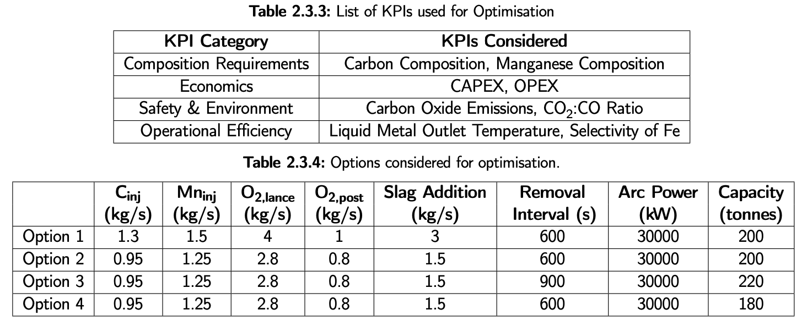
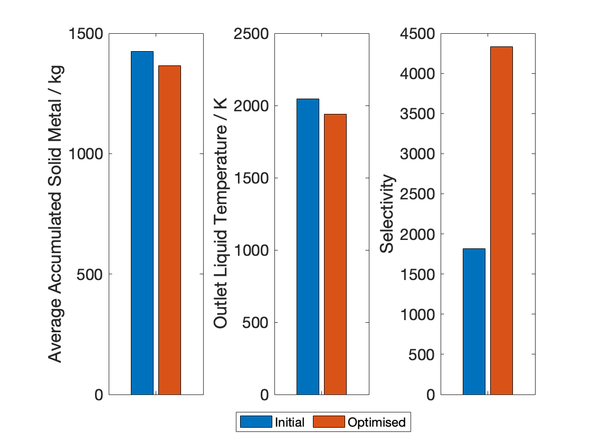

# Optimization

Based on results from the sensitivity analysis, the following optimisation strategy was developed:

- Due to the excess arc power in the initial model, the minimum arc power needed to melt the mixture of DRI and scrap according to their charge rate and temperature obtained from literature9 was used. This corresponded to a value of 30 MW.
- Since operational inefficiency was quantified by the excess temperature greater than the melting temperature and significant iron being oxidised in the initial model, the material addition rates and arc power were optimised. For this purpose, a grid search through range of values was utilised to determine the minimised operating expenditure while meeting the composition requirement and converging to stable steady-state.
- The mechanical design heuristics of the EAF uses the EAF operating capacity to the size of furnace chamber and bath. Therefore, the upper and lower sizes of the EAF were grouped into a single parameter termed the EAF volume, which serves to represent the CAPEX expenditure.
- The removal interval was not reduced further because the current interval of 600 seconds was already short compared to the residence time of current industrial operations.
- In order to find the best mode of operation from the various options proposed at each step of the optimisation, TOPSIS was utilised as a multi-criteria decision-making method using the initial aforementioned KPIs, along with the EAF CAPEX and OPEX, which consists of the 7 different process parameters investigated using sensitivity analysis except for product removal interval and arc power. The EAF CAPEX is based on the reactor volume, which is determined by the upper chamber size and lower bath size. The EAF OPEX is determined the carbon, ferromanganese, oxygen and slag-forming input requirements.
- From a thorough trial and error analysis using results from the extensive sensitivity analysis, four sets of parameters, or ’options’, were concluded to provide the best overall reactor performance.

## Result of Optimization

As a result of optimization, following improvements were made:

