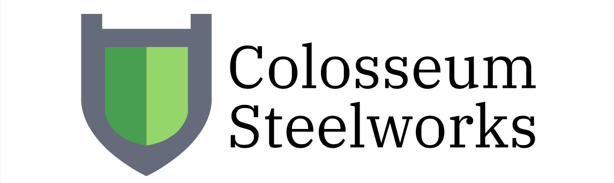
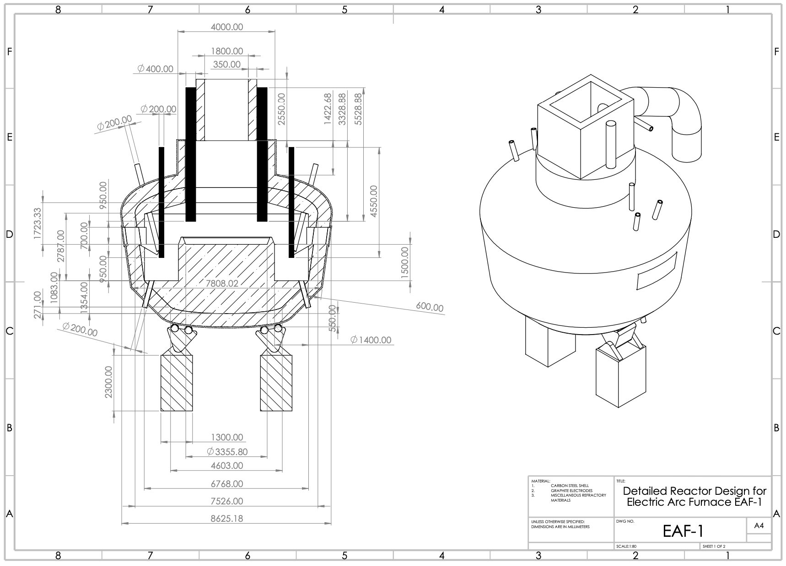
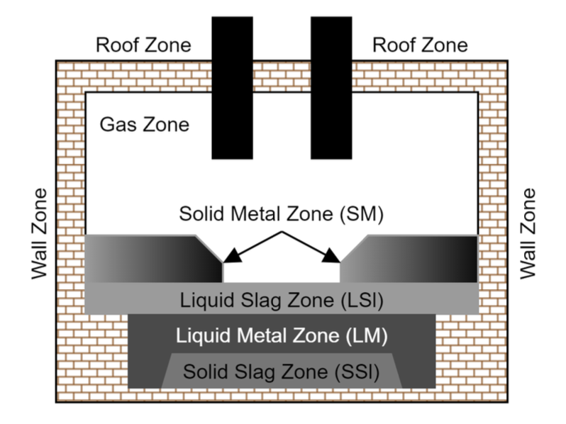
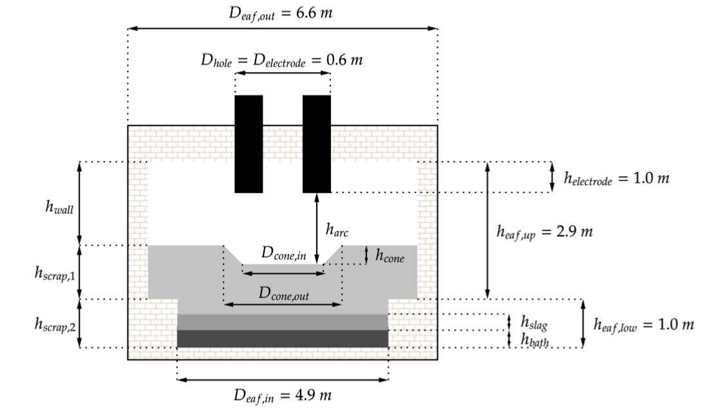
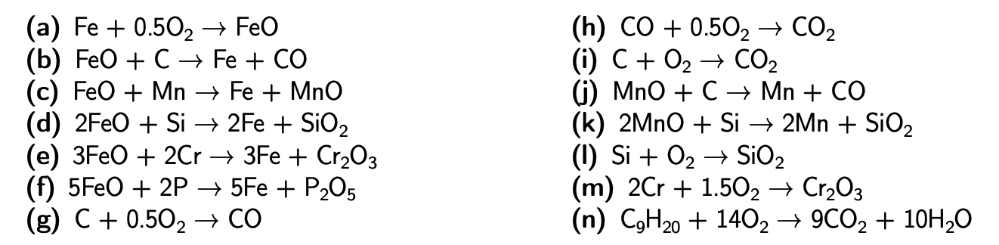

# EAF Modelling

## Introduction

This is the source code of the simulation of the EAF, chosen as the key reactor model of our project.
It was done as part of _Final Year Design Project of Chemical Engineering MEng degree_ in [Imperial College London](https://www.imperial.ac.uk). This reactor modelling was awarded exceptional grade of `A++` due to its exhaustiveness of simulation and novelty in reactor design. Reactor part of the report is on this repo and you can find it [here](./EAF_modelling_report.pdf).

## How to Start

Open the `eaf.m` file using [MATLAB](https://www.mathworks.com/products/matlab.html) and press `Run`.

It will generate graphs describing mass and compositions of different zones at different time under predefined condition.

It was developed using `MATLAB R2021a` so it's recommended to run with at least this version of `MATLAB`.

## EAF Design

The EAF plays crucial role in the steel production process as it converts the direct reduced iron (DRI) produced from the core chemical looping process along with steel scrap into the final steel product.

EAF was chosen over blast oxygen furnace as it outperforms from an environmental, process novelty and safety perspective, while only losing out in terms of overall economics and technological readiness.

This reactor model enables continuous operation as opposed to traditional batch operation, with its basis on an expired patent by the Danieli Corporation. The premise of design is the distinction between three separate ’melting zones’ within the furnace - a central melting zone flanked with two lateral shafts that are lower in elevation than the central melting zone. Each of the two lateral shafts are equipped with a bottom tapping port that enables continuous tapping of the liquid steel, as the furnace can be tilted 15 degrees to either side to discharge the product.

## EAF Model Simulation

### Key Assumptions

This model is time-variant, consisting of a combination of first-order differential equations and other algebraic relationships, solved using the fixed-step forward Euler method with a time interval of 10−3 s. In addition, discontinuities were modelled such that no instability issues occurred. The EAF is divided into different homogeneous zones where the components in each zone have identical chemical, thermal and physical properties. This assumption makes it simpler to model the relationships between different phases (solid, liquid and gas) present in the system.

### Heat Transfer

The EAF model consists of all three mechanisms of heat transfer: conduction, convection and radiation.

- Conduction occurs between zones that are in direct contact with one another.
- Convection occurs between the gas zone and the surrounding zones.
- Radiation occurs between zones depending on the value of the view factor.

In order to calculate the view factors, the surfaces were approximated as basic individual geometric shapes or a combination of these, with different spatial orientations. This is because the view factors change as a result of the geometric ratios changing during the operation of the furnace. Since the EAF is operated continuously for this process, the view factors are assumed to only consider
phase 3 (arc exposure to liquid metal) and phase 4 (slag foaming).

### Mass Transfer

Mass transfer happens through the following processes:

- Mass addition
- Mass Changes from Chemical Reactions
- Melting

Mass addition to each component in each zone either through direct reduced iron, scrap steel addition, ferromanganese addition, slag forming material addition, O2 lancing, O2 post-combustion and C injection is factored in. The changes in mass for each component within their respective zones occur due to the reactions taking place in the EAF. Using the heat transfer established above, the mass transfer relationships can be constructed.

### Thermo-Chemical Model

The oxidation and reduction reactions that are considered are based upon the significance of their impact on the overall energy balance of the EAF. The model assumes that all reactions take place in the liquid metal and liquid slag zones, except the CO post-combustion. The chosen reactions are following:

## Sensitivity Analysis

Refer to [Sensitivity/README.md](./Sensitivity/README.md)

## Optimization

Refer to [Optimization/README.md](./Optimization/README.md)

## Scope for Future Research

In terms of future recommendations, we believe that extensive research should be conducted on improving the nature of the view factor analysis included in the model. Due to the continuous mode of operation, modelling view factor behaviour such that the central melting zone and the lateral shafts are considered to be separate zones would greatly improve the reliability of results, as the radiative heat transfer phenomena would be more accurately represented.

Accounting for a continuous solid metal feed with semi-continuous tapping cycles would also be a means of expanding upon the phases of operation outlined in literature. To further improve tapping times and furnace efficiency, we can also look to adapt the findings from the patent further by testing out the viability of increasing the number of lateral shafts present within the reactor to three or four secondary zones such that tapping can occur more swiftly.

## References

1. V. Logar, D. Dovžan, and I. Škrjanc, “Modeling and Validation of an Electric Arc Furnace: Part 2, Thermo-chemistry”, Tech. Rep. 3, 2012, pp. 413–423.
2. “Modeling and Validation of an Electric Arc Furnace: Part 1, Heat and Mass Transfer”, ISIJ International, vol. 52, no. 3, pp. 402–412, 2012.
3. Danieli Corporation and World Intellectual Property Organization, Electric Arc Furnace for Continuous Charging, Nov. 2000.
4. Y. Toulouveski and I. Zinurov, Innovation in electric arc furnaces: Scientific basis for selection. Jan. 2010, pp. 1–258. [Online]. Available: https://www.researchgate.net/publication/290101174_Innovation_in_electric_arc_furnaces_Scientific_basis_for_selection.
5. V. Logar and I. Škrjanc, “Modeling and validation of the radiative heat transfer in an electric arc furnace”, ISIJ International, vol. 52, no. 7, pp. 1225–1232, 2012.
6. J. B. Ian, K. Craig, and P. Christiaan, “Modeling and Simulation of an Electric Arc Furnace Process”, Tech. Rep. 1, 1999, pp. 23–32.
7. Ramesh Singh, Applied Welding Engineering : Processes, Codes, and Standards. Elsevier Science & Technology, Nov. 2011, pp. 1–374.
8. METINVEST, Steel 1050. [Online]. Available: https://metinvestholding.com/en/products/steel-grades/1050.
9. S. Hornby, J. Madias, and F. Torre, “MYTHS AND REALITIES OF CHARGING DRI/HBI IN ELECTRIC ARC FURNACES”,
10. S. K. Dutta and R. Oza, “Aspect of Design and Developments in EAF”, Tech. Rep., Dec. 2014. [Online]. Available: https://www.researchgate.net/publication/307323617.
11. Ispat Guru, Design Features of an AC Electric Arc Furnace, Feb. 2015. [Online]. Available: https://www.ispatguru.com/design-features-of-an-ac-electric-arc-furnace/.
12. Coidan Graphite, Arc Furnace Electrode. [Online]. Available: https://www.coidan.com/services/electrodes/arc-furnace-electrodes/#:~:text=Graphite%20electrodes%20are%20primarily%20used,is%20white%20hot%20circa%205000%C2%BAC.
13. D. Headquarters, “THE RELIABLE AND INNOVATIVE PARTNER IN THE METALS INDUSTRY DANIELI WATER COOLED ELEMENTS for steelmaking furnaces and equipment”, Italy, Tech. Rep. [Online]. Available: https://www.danieli.com/media/download/img_4187.pdf.
14. Ispat Guru, Refractory Lining of the Electric Arc Furnace. [Online]. Available: https://www.ispatguru.com/refractory-lining-of-the-electric-arc-furnace/.
15. Elsa Gao, Refractory materials for different parts of electric ARC furnace, Jul. 2017. [Online]. Available: https://www.linkedin.com/pulse/refractory-materials-different-parts-electric-arc-furnace-gao/.
16. D. Olawale and F. Oyawale, “Design and Prototype Development of a Mini-Electric Arc Furnace”, May 2007. [Online]. Available: https://www.researchgate.net/publication/237242189.
17. F. Liu, R. Zhu, G. Wei, and S. Fan, “Effect of lance structure on behavior of coherent jet in EAF steelmaking process”, Materials, vol. 13, no. 5, Mar. 2020.
18. M. Kirschen and H. Pfeifer, “Off-gas measurements at the EAF primary dedusting system”, Tech. Rep., 2005. [Online]. Available: https://www.researchgate.net/publication/276388593.
19. Zhang Y. and Fruehan R.J., “Effect Of Gas Type And Pressure On Slag Foaming”, [Online]. Available: https://link.springer.com/article/10.1007/BF02654112.
20. B. Bowman, J. Jones, and P. Lefrank, “Chapter 10. Electric Furnace Steelmaking”, in The Making, Shaping and Treating of Steel, 10th ed., Pittsburgh, US: The AISE Steel Foundation, 1998, pp. 525–600.
21. Eramet Comillog, “HIGH CARBON FERROMANGANESE HCFeMn”, Tech. Rep. [Online]. Available:
    https://www.eramet.com/sites/default/files/inline-files/eramet_high_carbon_ferromanganese_1.pdf.
22. E. Turkdogan, Fundamentals of Steel Making. Leeds: The Institute of Materials, 1996.
23. S. Basu, A. K. Lahiri, and S. Seetharaman, “Activity of iron oxide in steelmaking slag”, Metallurgical and
    Materials Transactions B: Process Metallurgy and Materials Processing Science, vol. 39, no. 3, pp. 447–456, Jun. 2008.
24. J. G. Bekker, I. K. Craig, and P. C. Pistorius, “Modeling and Simulation of an Electric Arc Furnace Process”, ISIJ International, vol. 39, no. 1, pp. 23–32, 1999.
25. M. Meraikib, “Activity of Silica in the Slag of an Electric Arc Furnace Using Direct Reduced lron for Steelmaking”, Tech. Rep. 1, 1995, pp. 845–850.
26. S. Basu, A. K. Lahiri, and S. Seetharaman, “Phosphorus partition between liquid steel and CaO-SiO2-P 2O5-MgO slag containing low FeO”, Metallurgical and Materials Transactions B: Process Metallurgy and Materials Processing Science, vol. 38, no. 3, pp. 357–366, Jun. 2007.

## Acknowledgement

Special thanks to teammates of Colosseum Steelworks:

- Aiman Syahirah Ahmad Dzulfakhar
- Theeranai (Bek) Charaschanya
- Athanasios (Thanos) Charos
- Naomi Duru
- Fatima Elzahra Khan
- En You Sim
- Alessandro Tonus
- Pierre Walker
- Richard Woolley

Also, thank you very much to supervisors who helped us throughout the process

- [Jason P. Hallet](https://www.imperial.ac.uk/people/j.hallett)
- [Paul Fennell](https://www.imperial.ac.uk/people/p.fennell)

## Change Log

- 2023-11-25: Added proper READMEs and remove unnecessary files from the repo.
