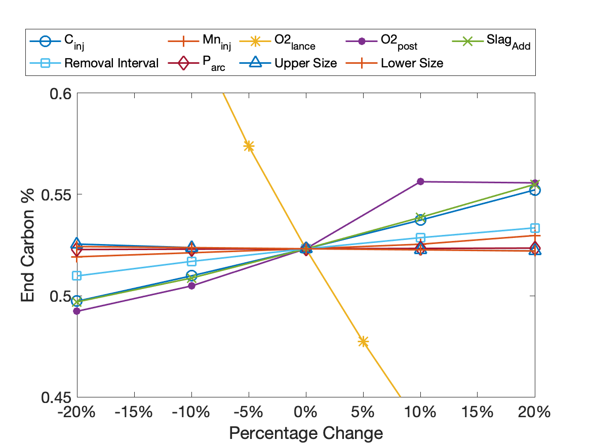
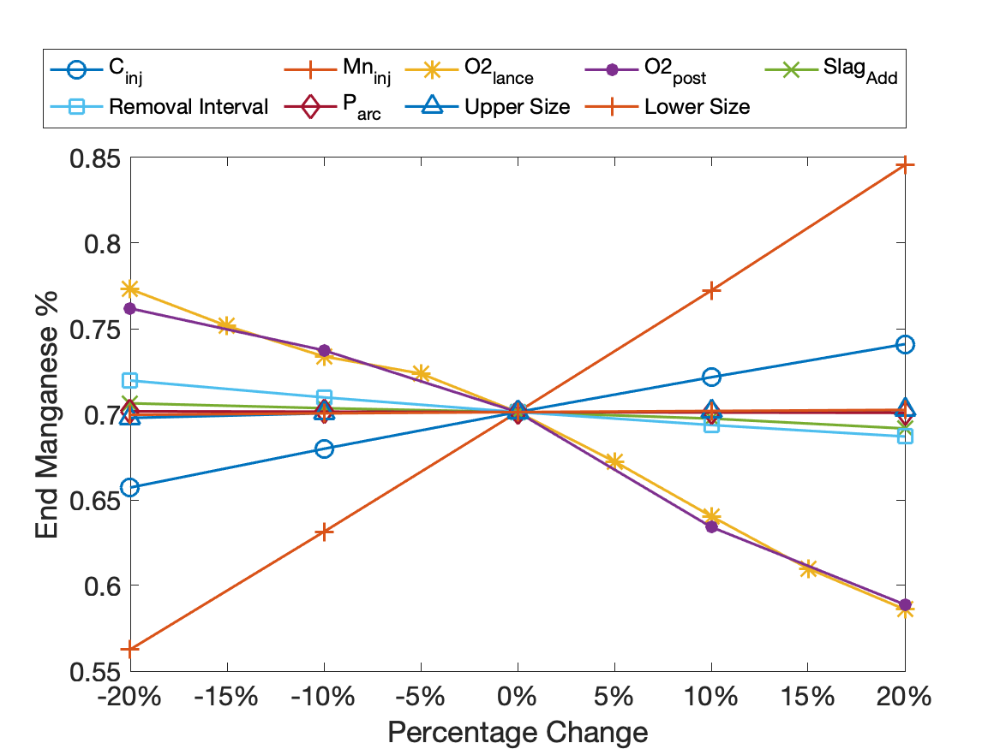
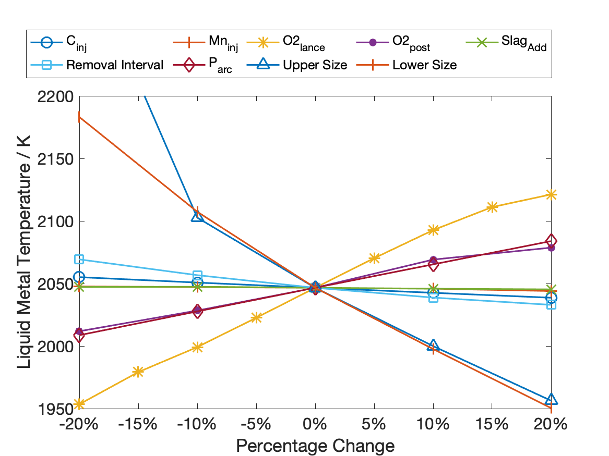
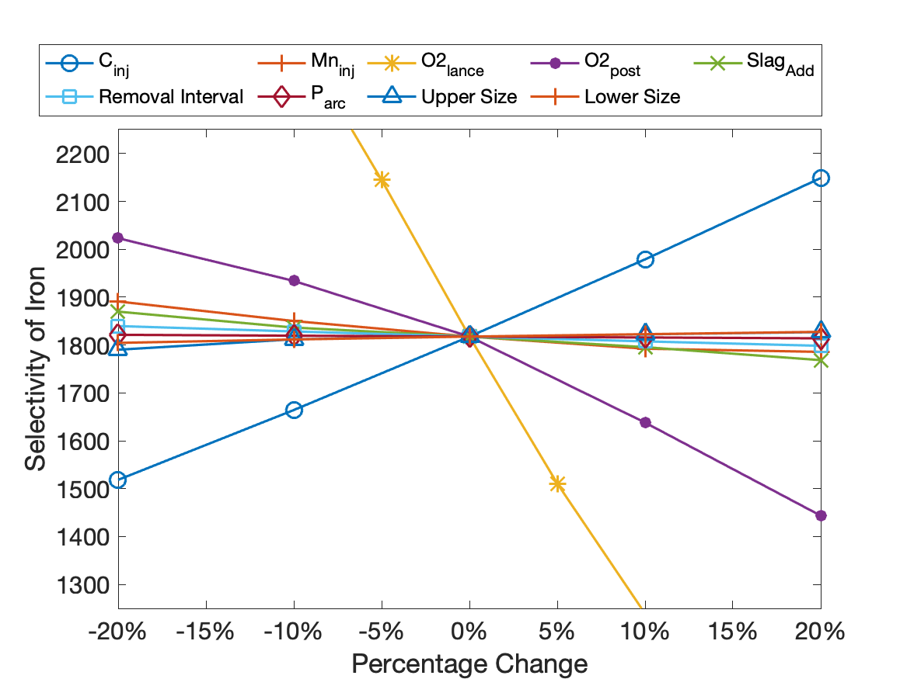
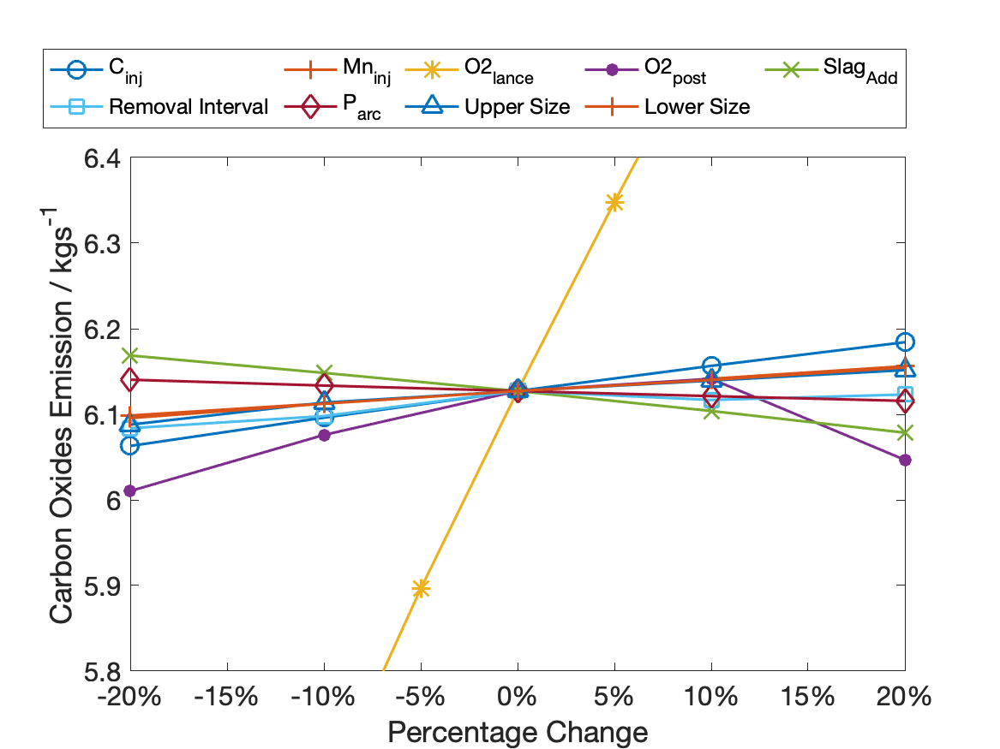
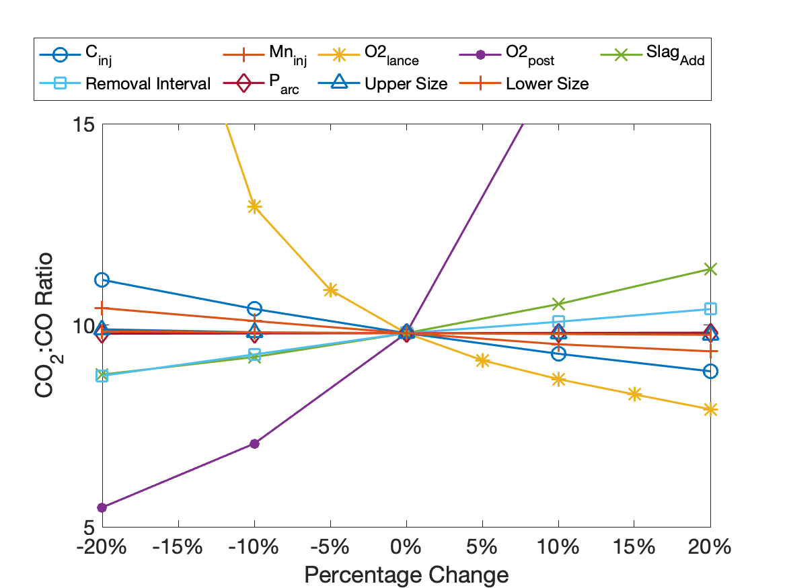

# Sensitivity Analysis

To conduct an effective sensitivity analysis, the effect of changing 9 different process parameters on a total of 6 performance indicators was investigated. The process parameters are listed below, and were varied by 20% in either direction from the nominal values in the initial model in increments of 10%. As the oxygen lancing rate parameter was particularly sensitive to various performance measures, the increment was reduced to 5% for this parameter.

1. Carbon Injection Rate
2. Ferromanganese Injection Rate
3. Oxygen Lancing Rate
4. Oxygen Post-combustion Rate
5. Slag-forming Agent Addition Rate
6. Product Removal Interval
7. Arc Power
8. Reactor Shell Upper Chamber Size
9. Reactor Shell Lower Bath Size

The effect of these 9 different process parameters were observed on the following 6 KPIs (Key Performance Indicators) that take into account composition requirements, emissions and operational efficiency.

1. Carbon Composition in Liquid Metal
2. Manganese Composition in Liquid Metal
3. Liquid Metal Outlet Temperature
4. Selectivity of Fe
5. Carbon Oxide Emissions
6. CO2:CO Ratio

To ensure consistency among all the sensitivity experiments and to demonstrate sufficiently convergent behaviour, each experimental run was simulated for an additional 5 operating cycles with the respective change in parameter.

## Carbon Composition

## Manganese Composition

## Outlet Temperature

## Selectivity of Fe

## Carbon Oxides Emission

## CO2:CO Ratio

